# MiniMind 算法层级 Tutorial

> 面向大模型算法岗面试的系统性知识整理

## 目录

1. [项目概述与架构总览](#1-项目概述与架构总览)
2. [模型架构详解](#2-模型架构详解)
3. [预训练与监督微调](#3-预训练与监督微调)
4. [对齐算法详解](#4-对齐算法详解)
5. [知识蒸馏算法](#5-知识蒸馏算法)
6. [面试高频问题汇总](#6-面试高频问题汇总)
7. [核心代码深度解析](#7-核心代码深度解析)

---

## 1. 项目概述与架构总览

### 1.1 MiniMind 是什么？

MiniMind 是一个极简大语言模型开源项目，特点如下：

- **极轻量级**：最小模型仅 25.8M 参数（GPT-3 的 1/7000）
- **低成本**：仅需 3 元人民币 + 2 小时即可训练完成
- **全流程开源**：包含预训练、SFT、LoRA、DPO、PPO/GRPO/SPO 等完整算法
- **PyTorch 原生重构**：不依赖第三方抽象接口，从零实现核心算法

### 1.2 核心能力

```mermaid
---
config:
  theme: base
  themeVariables:
    primaryColor: "#e8f4f8"
    primaryBorderColor: "#2d6a7c"
    primaryTextColor: "#1a3a42"
    secondaryColor: "#f5f0e8"
    tertiaryColor: "#f0f5e8"
    lineColor: "#4a6670"
    fontFamily: "Georgia, serif"
    fontSize: "14px"
---
graph TD
    A((<b>MiniMind<br/>项目</b>)) --> B[<b>模型架构</b><br/>Model Architecture]
    A --> C[<b>训练算法</b><br/>Training Algorithms]
    A --> D[<b>工程实践</b><br/>Engineering]
    
    B --> B1[📦 Transformer]
    B --> B2[📍 RoPE 位置编码]
    B --> B3[🔀 GQA 注意力]
    B --> B4[🧩 MoE 混合专家]
    
    C --> C1[🚀 预训练]
    C --> C2[🎯 SFT 微调]
    C --> C3[⚖️ 对齐算法]
    C --> C4[📚 知识蒸馏]
    
    D --> D1[⚡ Flash Attention]
    D --> D2[🔢 混合精度训练]
    D --> D3[🌐 分布式训练]
    D --> D4[💾 检查点恢复]
    
    style A fill:#3d5a80 stroke:#293241 stroke-width:3px
    style B fill:#98c1d9 stroke:#293241 stroke-width:2px
    style C fill:#98c1d9 stroke:#293241 stroke-width:2px
    style D fill:#98c1d9 stroke:#293241 stroke-width:2px
    style B1 fill:#e0fbfc stroke:#2d6a7c stroke-width:1px
    style B2 fill:#e0fbfc stroke:#2d6a7c stroke-width:1px
    style B3 fill:#e0fbfc stroke:#2d6a7c stroke-width:1px
    style B4 fill:#e0fbfc stroke:#2d6a7c stroke-width:1px
    style C1 fill:#fcf6bd stroke:#d0a04b stroke-width:1px
    style C2 fill:#fcf6bd stroke:#d0a04b stroke-width:1px
    style C3 fill:#fcf6bd stroke:#d0a04b stroke-width:1px
    style C4 fill:#fcf6bd stroke:#d0a04b stroke-width:1px
    style D1 fill:#d4e09b stroke:#6a994e stroke-width:1px
    style D2 fill:#d4e09b stroke:#6a994e stroke-width:1px
    style D3 fill:#d4e09b stroke:#6a994e stroke-width:1px
    style D4 fill:#d4e09b stroke:#6a994e stroke-width:1px
```

### 1.3 完整训练流程

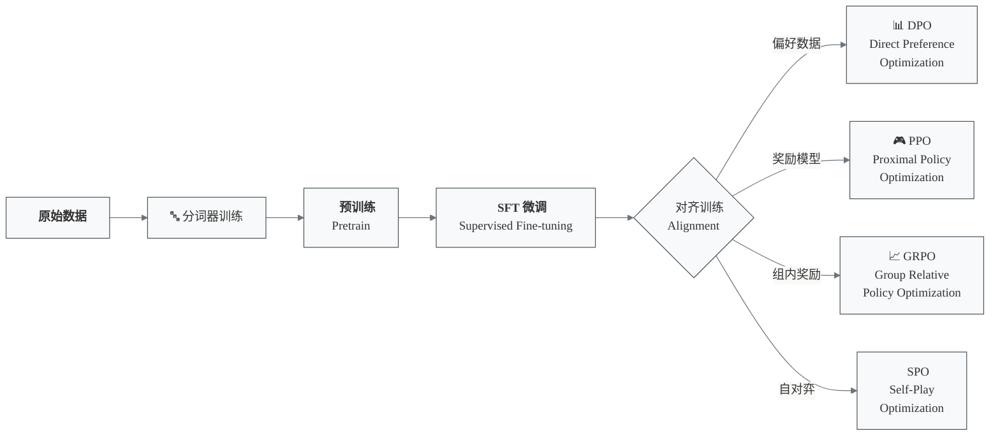

---

## 2. 模型架构详解

### 2.1 整体架构

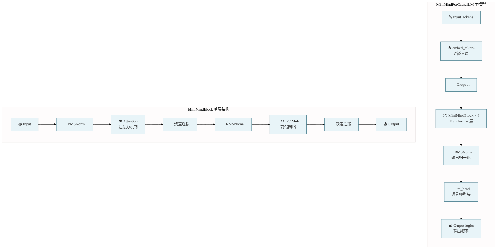

### 2.2 关键技术组件

#### 2.2.1 MiniMindConfig 配置类

```python
class MiniMindConfig:
    def __init__(
        self,
        dropout: float = 0.0,
        hidden_size: int = 512,      # 隐藏层维度
        num_attention_heads: int = 8,  # 注意力头数
        num_hidden_layers: int = 8,    # Transformer 层数
        num_key_value_heads: int = 2,  # KV 头数（GQA 关键）
        vocab_size: int = 6400,        # 词表大小
        max_position_embeddings: int = 32768,  # 最大位置
        rope_theta: int = 1000000.0,   # RoPE 基础频率
        inference_rope_scaling: bool = False,  # YaRN 外推
        flash_attn: bool = True,       # Flash Attention
        use_moe: bool = False,         # MoE 开关
        num_experts_per_tok: int = 2,  # 每 token 激活专家数
        n_routed_experts: int = 4,     # 总专家数
    ):
```

#### 2.2.2 RMSNorm vs LayerNorm

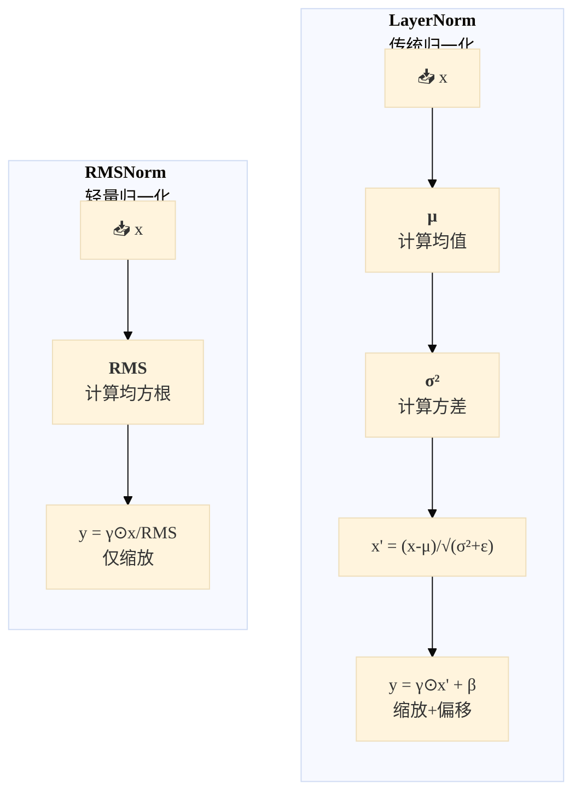

**RMSNorm 代码实现**：
```python
class RMSNorm(nn.Module):
    def __init__(self, dim: int, eps: float = 1e-5):
        super().__init__()
        self.eps = eps
        self.weight = nn.Parameter(torch.ones(dim))
    
    def forward(self, x):
        return self.weight * torch.rsqrt(
            x.pow(2).mean(-1, keepdim=True) + self.eps
        ).type_as(x)
```

**面试要点**：
- RMSNorm其核心假设是：重新平移（Re-centering，即减去均值）对模型性能的贡献很小，而重新缩放（Re-scaling）才是关键。
- RMSNorm 比 LayerNorm 更轻量（少 2 个可学习参数：β 和 var）
- 在 FP16/BF16 等半精度训练中，减法操作有时会带来数值不稳定性。RMSNorm 的逻辑更简单，更适合现代显卡的并行加速（Fused Kernel）。
- 仅需计算 RMS（均方根），不需要计算均值
- LLaMA 系列 (Meta),Gemma (Google),Mistral / Mixtral,DeepSeek 系列,Qwen系列

### 2.3 RoPE 位置编码

#### 2.3.1 RoPE 核心原理

RoPE（Rotary Position Embedding）将绝对位置信息编码为旋转矩阵：

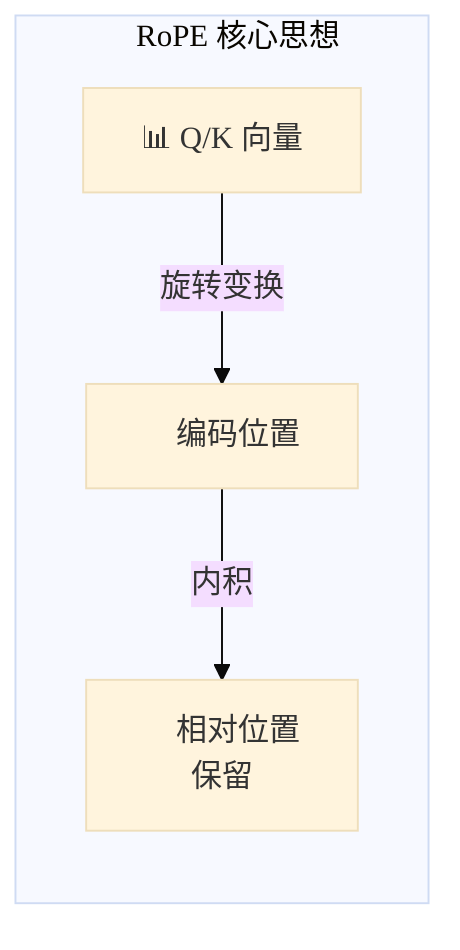

**数学公式**：
$$RoPE(q_m, k_n) = Re[(q_m e^{imθ}) (k_n e^{inθ})^*]$$

**核心思想**:
在复平面上，通过旋转一个向量来注入位置信息。
- 每个 token 根据其所在位置 $m$，在特征向量上施加一个特定的旋转角度
- 当两个向量 $q$（位置 $m$）和 $k$（位置 $n$）做点积时，其结果只取决于它们之间的相对夹角（即 $m-n$），而与绝对旋转了多少无关。

#### 2.3.2 代码实现

```python
def precompute_freqs_cis(dim: int, end: int, rope_base: float = 1e6):
    # 计算频率向量
    freqs = 1.0 / (rope_base ** (torch.arange(0, dim, 2).float() / dim))
    
    # 生成位置索引
    t = torch.arange(end, device=freqs.device)
    freqs = torch.outer(t, freqs)
    
    # 合并 cos 和 sin
    freqs_cos = torch.cat([torch.cos(freqs), torch.cos(freqs)], dim=-1)
    freqs_sin = torch.cat([torch.sin(freqs), torch.sin(freqs)], dim=-1)
    
    return freqs_cos, freqs_sin

def apply_rotary_pos_emb(q, k, cos, sin):
    def rotate_half(x):
        # 旋转操作：[-x₂, x₁]
        return torch.cat((-x[..., x.shape[-1] // 2:], 
                          x[..., : x.shape[-1] // 2]), dim=-1)
    
    q_embed = q * cos.unsqueeze(unsqueeze_dim) + rotate_half(q) * sin.unsqueeze(unsqueeze_dim)
    k_embed = k * cos.unsqueeze(unsqueeze_dim) + rotate_half(k) * sin.unsqueeze(unsqueeze_dim)
    return q_embed, k_embed
```

**代码解读**：
- 生成一张旋转参数表，频率不同表示不同维度的旋转速度是不一样的。
- 将位置索引 $t$ (0, 1, 2...) 与频率相乘。得到一个矩阵，每一行代表一个位置，每一列对应一个维度的旋转角度 $\theta = m \cdot \theta_i$。
- 执行二维平面的旋转

#### 2.3.3 YaRN 位置编码外推

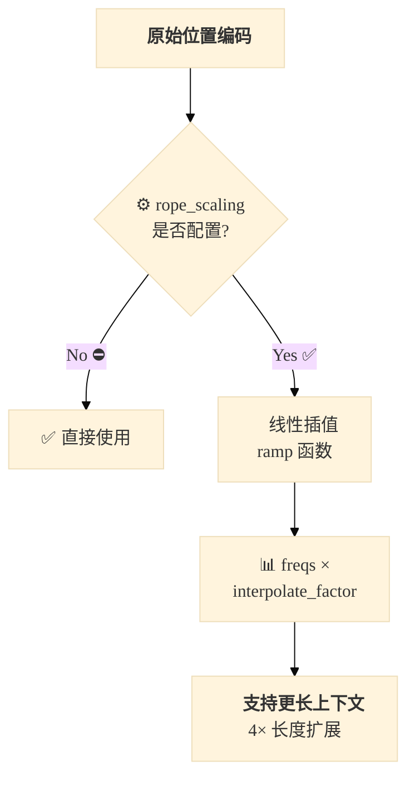

```python
if rope_scaling is not None:
    orig_max = rope_scaling["original_max_position_embeddings"]
    factor = rope_scaling["factor"]
    
    if end / orig_max > 1.0:
        # 线性插值 ramp
        ramp = torch.clamp(
            (torch.arange(dim // 2) - low) / max(high - low, 0.001), 
            0, 1
        )
        freqs = freqs * (1 - ramp + ramp / factor)
```

**面试要点**：
- 绝对位置编码外推性差，相对位置编码计算开销大。
- RoPE 的优势：外推性好、计算高效、可外推无限长度
- YaRN 核心思想：低频位置线性插值，高频保持原样
- MiniMind 支持 4 倍长度扩展

### 2.4 Grouped Query Attention (GQA)

#### 2.4.1 注意力机制演进

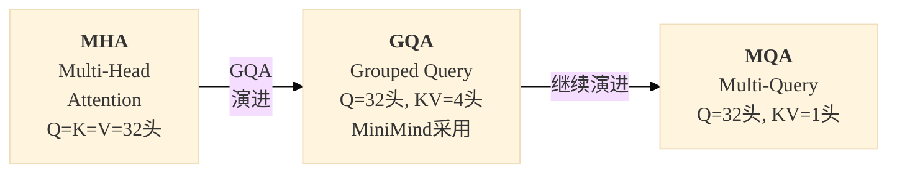

#### 2.4.2 GQA 代码实现

```python
class Attention(nn.Module):
    def __init__(self, args: MiniMindConfig):
        self.num_key_value_heads = args.num_key_value_heads  # KV 头数
        self.n_local_heads = args.num_attention_heads        # Q 头数
        self.n_local_kv_heads = self.num_key_value_heads     # KV 头数
        self.n_rep = self.n_local_heads // self.n_local_kv_heads  # 复制倍数
        
        self.head_dim = args.hidden_size // args.num_attention_heads
        
        # Q, K, V 独立投影
        self.q_proj = nn.Linear(args.hidden_size, args.num_attention_heads * self.head_dim)
        self.k_proj = nn.Linear(args.hidden_size, self.num_key_value_heads * self.head_dim)
        self.v_proj = nn.Linear(args.hidden_size, self.num_key_value_heads * self.head_dim)

def repeat_kv(x: torch.Tensor, n_rep: int) -> torch.Tensor:
    """将 KV 头复制 n_rep 次以匹配 Q 头数量"""
    bs, slen, num_key_value_heads, head_dim = x.shape
    return (
        x[:, :, :, None, :].expand(bs, slen, num_key_value_heads, n_rep, head_dim)
        .reshape(bs, slen, num_key_value_heads * n_rep, head_dim)
    )
```

**面试要点**：
- GQA 优势：
  -  在推理（Inference）时，我们需要缓存之前的 $KV$ 值（KV Cache）。如果 $KV$ 头数减少到 1/4，KV Cache 占用的显存直接减少 75%。这对于长文本生成至关重要。
  -  推理时的瓶颈往往不在计算量，而在从显存读取 KV Cache 的速度。$KV$ 变少了，数据搬运就变快了，推理速度（Tokens/s）大幅提升。
- Qwen2、Llama3 采用 GQA
- MiniMind 默认配置：Q=8 头，KV=2 头（4 倍压缩）

### 2.5 Flash Attention

#### 2.5.1 传统 Attention vs Flash Attention

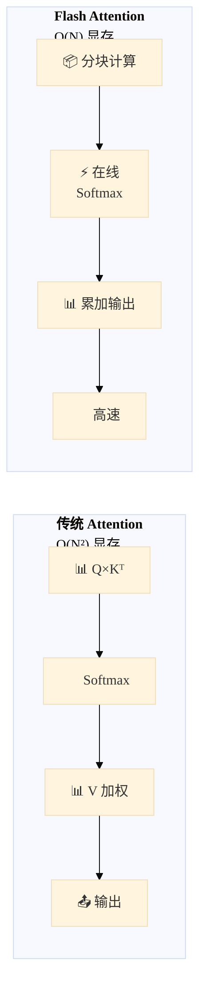

```python
if self.flash and seq_len > 1:
    # Flash Attention 利用 CUDA 核函数
    output = F.scaled_dot_product_attention(
        xq, xk, xv,
        dropout_p=self.dropout if self.training else 0.0,
        is_causal=True  # 因果掩码
    )
else:
    # 手动计算（兼容性方案）
    scores = (xq @ xk.transpose(-2, -1)) / math.sqrt(self.head_dim)
    scores = scores + torch.triu(
        torch.full((seq_len, seq_len), float("-inf")),
        diagonal=1
    ).unsqueeze(0).unsqueeze(0)
```

### 2.6 MoE 混合专家模型

#### 2.6.1 MoE 架构

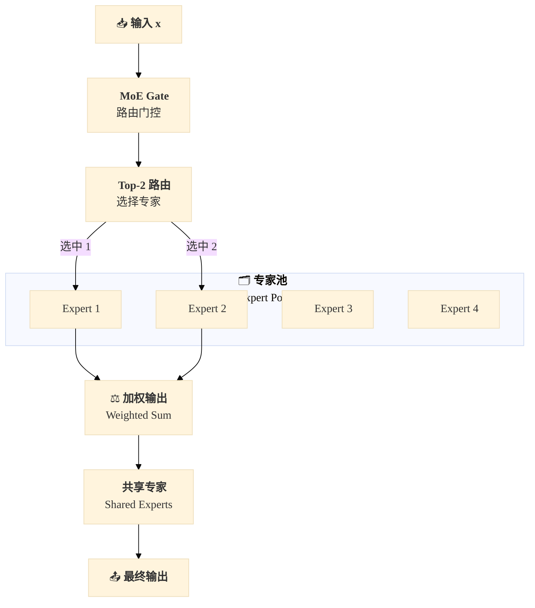

#### 2.6.2 MoE Gate 代码

```python
class MoEGate(nn.Module):
    def forward(self, hidden_states):
        # 1. 计算专家评分
        logits = F.linear(hidden_states, self.weight, None)
        scores = logits.softmax(dim=-1)
        
        # 2. Top-K 选择
        topk_weight, topk_idx = torch.topk(scores, k=self.top_k, dim=-1)
        
        # 3. 标准化权重
        if self.top_k > 1 and self.norm_topk_prob:
            denominator = topk_weight.sum(dim=-1, keepdim=True) + 1e-20
            topk_weight = topk_weight / denominator
        
        # 4. 辅助损失：负载均衡
        if self.training and self.alpha > 0.0:
            aux_loss = self._compute_aux_loss(topk_idx, scores)
        
        return topk_idx, topk_weight, aux_loss
    
    def _compute_aux_loss(self, topk_idx, scores):
        # 负载均衡辅助损失
        _, num_expert = topk_idx.shape
        expert_mask = F.one_hot(topk_idx, num_expert).float()
        expert_load = expert_mask.sum(dim=0) / expert_mask.sum(dim=1).unsqueeze(0)
        aux_loss = (expert_load ** 2).mean() * self.num_experts_per_tok
        return aux_loss
```

#### 2.6.3 MOE FeedForward 代码

```python
class MOEFeedForward(nn.Module):
    def forward(self, x):
        # 1. 获取路由决策
        topk_idx, topk_weight, aux_loss = self.gate(x)
        
        if self.training:
            # 训练时：scatter 合并
            y = torch.zeros_like(x)
            for i, expert in enumerate(self.experts):
                y[flat_topk_idx == i] = expert(x[flat_topk_idx == i])
            y = (y.view(*topk_weight.shape, -1) * topk_weight.unsqueeze(-1)).sum(dim=1)
        else:
            # 推理时：排序优化
            y = self.moe_infer(x, flat_topk_idx, topk_weight.view(-1, 1))
        
        # 2. 共享专家
        if self.config.n_shared_experts > 0:
            for expert in self.shared_experts:
                y = y + expert(identity)
        
        self.aux_loss = aux_loss
        return y
```

**面试要点**：
- MoE 核心思想：稀疏激活，每个 token 只激活部分专家
- 负载均衡损失：防止专家塌陷
- 共享专家：提高专家间知识共享

---

## 3. 预训练与监督微调

### 3.1 预训练 (Pretrain)

#### 3.1.1 目标函数

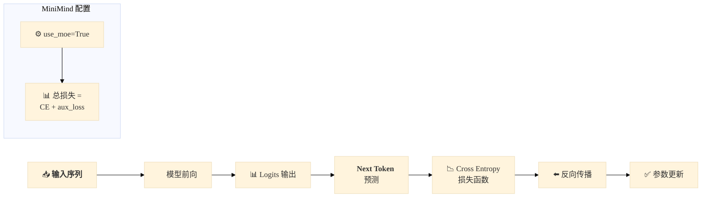

```python
def train_step(model, X, Y, loss_mask):
    # 前向传播
    res = model(X)
    logits = res.logits  # [B, seq_len, vocab_size]
    
    # 计算损失
    loss_fct = nn.CrossEntropyLoss(reduction='none')
    loss = loss_fct(logits.view(-1, logits.size(-1)), Y.view(-1))
    
    # 损失掩码
    loss_mask_flat = loss_mask.view(-1)
    loss = torch.sum(loss * loss_mask_flat) / loss_mask_flat.sum()
    
    # MoE 辅助损失
    if lm_config.use_moe:
        loss += res.aux_loss
    
    return loss
```

#### 3.1.2 混合精度训练

```python
# 自动混合精度 (AMP)
dtype = torch.bfloat16 if args.dtype == "bfloat16" else torch.float16
autocast_ctx = torch.cuda.amp.autocast(dtype=dtype)

scaler = torch.cuda.amp.GradScaler(enabled=(args.dtype == 'float16'))

with autocast_ctx:
    loss = compute_loss()
    
scaler.scale(loss).backward()
scaler.unscale_(optimizer)
torch.nn.utils.clip_grad_norm_(model.parameters(), args.grad_clip)
scaler.step(optimizer)
scaler.update()
```

### 3.2 SFT 监督微调

#### 3.2.1 数据格式

```json
{
  "conversations": [
    {"role": "user", "content": "你好"},
    {"role": "assistant", "content": "你好！有什么可以帮助你的吗？"}
  ]
}
```

#### 3.2.2 ChatML 模板

```python
def _create_chat_prompt(self, conversations):
    prompt = ""
    for msg in conversations:
        if msg["role"] == "user":
            prompt += f"<|im_start|>user\n{msg['content']}<|im_end|>\n"
        elif msg["role"] == "assistant":
            prompt += f"<|im_start|>assistant\n{msg['content']}<|im_end|>\n"
    prompt += "<|im_start|>assistant"
    return prompt
```

#### 3.2.3 动态损失掩码

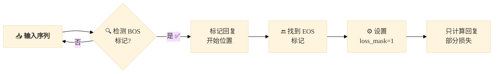

```python
def _generate_loss_mask(self, input_ids):
    loss_mask = [0] * len(input_ids)
    i = 0
    while i < len(input_ids):
        if input_ids[i:i + len(self.bos_id)] == self.bos_id:
            start = i + len(self.bos_id)
            end = start
            while end < len(input_ids):
                if input_ids[end:end + len(self.eos_id)] == self.eos_id:
                    break
                end += 1
            # 只对 assistant 回复部分计算损失
            for j in range(start + 1, min(end + len(self.eos_id) + 1, self.max_length)):
                loss_mask[j] = 1
            i = end + len(self.eos_id)
        else:
            i += 1
    return loss_mask
```

---

## 4. 对齐算法详解

### 4.1 对齐算法全景

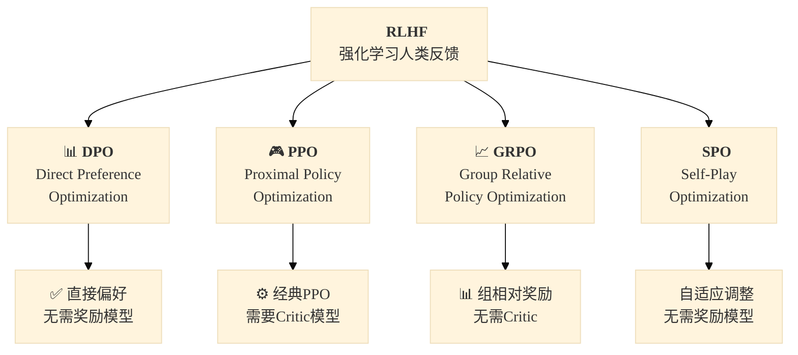

### 4.2 DPO (Direct Preference Optimization)

#### 4.2.1 核心思想

DPO 通过直接优化偏好数据来对齐模型，无需显式的奖励模型。

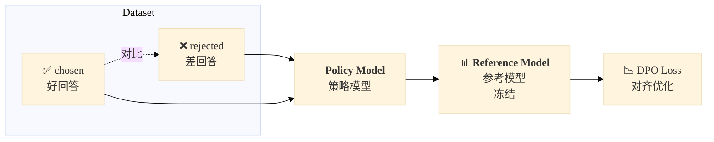

#### 4.2.2 DPO 损失函数

```python
def dpo_loss(ref_log_probs, policy_log_probs, mask, beta=0.1):
    # 序列平均 log prob
    seq_lengths = mask.sum(dim=1, keepdim=True).clamp_min(1e-8)
    ref_log_probs = (ref_log_probs * mask).sum(dim=1) / seq_lengths.squeeze()
    policy_log_probs = (policy_log_probs * mask).sum(dim=1) / seq_lengths.squeeze()
    
    # 分离 chosen 和 rejected
    batch_size = ref_log_probs.shape[0]
    chosen_ref = ref_log_probs[:batch_size // 2]
    reject_ref = ref_log_probs[batch_size // 2:]
    chosen_pol = policy_log_probs[:batch_size // 2]
    reject_pol = policy_log_probs[batch_size // 2:]
    
    # DPO 核心公式
    # π(y⁺) - π(y⁻): 策略模型的概率差
    # ref(y⁺) - ref(y⁻): 参考模型的概率差
    pi_logratios = chosen_pol - reject_pol
    ref_logratios = chosen_ref - reject_ref
    logits = pi_logratios - ref_logratios
    
    # -log(sigmoid(β * logit))
    loss = -F.logsigmoid(beta * logits)
    return loss.mean()
```

**面试要点**：
- DPO vs PPO：无需奖励模型、训练更稳定
- 公式推导：从 KL 散度 + Bradley-Terry 模型推导而来
- Reference Model 作用：防止模型偏离 SFT 模型太远

### 4.3 PPO (Proximal Policy Optimization)

#### 4.3.1 PPO 算法架构

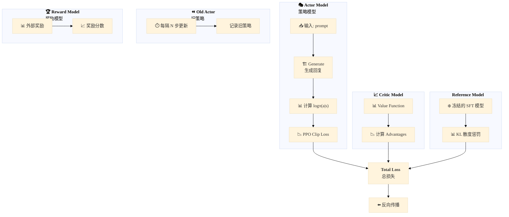

#### 4.3.2 PPO 核心代码

```python
def ppo_train_step(batch, actor_model, old_actor_model, ref_model, critic_model):
    prompts = batch["prompt"]
    
    # 1. 生成 responses
    gen_out = actor_model.generate(
        input_ids=enc.input_ids,
        attention_mask=enc.attention_mask,
        max_new_tokens=args.max_gen_len,
        do_sample=True,
        temperature=0.8
    )
    
    # 2. 计算奖励
    responses_text = decode_responses(gen_out, prompt_lengths)
    rewards = reward_model(responses_text)
    
    # 3. 计算 advantages
    values = critic_model(gen_out)[:, -1]
    advantages = rewards - values.detach()
    
    # 4. 计算策略损失 (PPO Clip)
    logits = actor_model(gen_out).logits[:, :-1]
    logp_tokens = get_token_logps(logits, labels)
    actor_logp = (logp_tokens * final_mask).sum(dim=1)
    
    with torch.no_grad():
        old_logits = old_actor_model(gen_out).logits[:, :-1]
        old_logp = get_token_logps(old_logits, labels)
        old_logp = (old_logp * final_mask).sum(dim=1)
    
    # PPO Clip 公式
    ratio = torch.exp(actor_logp - old_logp)
    surr1 = ratio * advantages
    surr2 = torch.clamp(ratio, 1.0 - args.clip_epsilon, 1.0 + args.clip_epsilon) * advantages
    policy_loss = -torch.min(surr1, surr2).mean()
    
    # 5. 价值损失和 KL 损失
    value_loss = F.mse_loss(values, rewards)
    kl_ref = (actor_logp - ref_logp).mean()
    
    # 总损失
    loss = policy_loss + args.vf_coef * value_loss + args.kl_coef * kl_ref
    return loss
```

**面试要点**：
- PPO Clip 公式：限制策略更新幅度，防止崩溃
- KL 散度惩罚：防止策略偏离参考模型太远
- Advantages 计算：R - V(s)，衡量动作的相对好坏

### 4.4 GRPO (Group Relative Policy Optimization)

#### 4.4.1 GRPO 核心思想

GRPO 相对于 PPO 的改进：使用组内相对奖励，无需 Critic 模型。

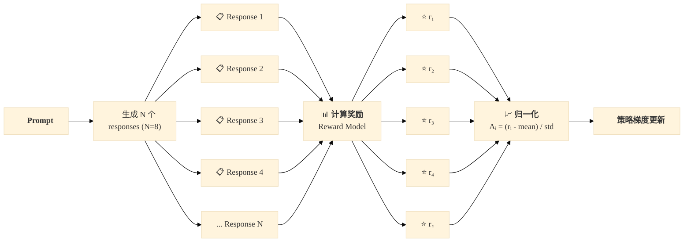

#### 4.4.2 GRPO 核心代码

```python
def grpo_train_step(prompts, model, ref_model, reward_model):
    batch_size = len(prompts)
    
    # 1. 生成多个 responses
    outputs = model.generate(
        **prompt_inputs,
        max_new_tokens=args.max_gen_len,
        num_return_sequences=args.num_generations,  # 8个
        do_sample=True,
        temperature=0.8
    )
    
    completions = decode_responses(outputs)
    
    # 2. 计算奖励
    rewards = calculate_rewards(prompts, completions, reward_model)
    
    # 3. 奖励归一化 (组内相对)
    grouped_rewards = rewards.view(-1, args.num_generations)
    mean_r = grouped_rewards.mean(dim=1).repeat_interleave(args.num_generations)
    std_r = grouped_rewards.std(dim=1).repeat_interleave(args.num_generations)
    
    # 限制范围 + 标准归一化
    advantages = torch.clamp((rewards - mean_r) / (std_r + 1e-4), -10, 10)
    advantages = (advantages - advantages.mean()) / (advantages.std() + 1e-8)
    
    # 4. 计算 KL 散度
    per_token_logps = get_per_token_logps(model, outputs)
    ref_per_token_logps = get_per_token_logps(ref_model, outputs)
    kl_div = ref_per_token_logps - per_token_logps
    per_token_kl = torch.exp(kl_div) - kl_div - 1
    
    # 5. GRPO 损失
    per_token_loss = -(
        torch.exp(per_token_logps - per_token_logps.detach()) * advantages.unsqueeze(1)
        - args.beta * per_token_kl
    )
    
    loss = ((per_token_loss * completion_mask).sum(dim=1) / 
            completion_mask.sum(dim=1)).mean()
    return loss
```

**面试要点**：
- GRPO 优势：无需 Critic 模型，计算更高效
- 组内归一化：消除奖励尺度的影响
- 适合场景：代码生成、数学推理等有明确标准答案的任务

### 4.5 SPO (Self-Play Optimization)

#### 4.5.1 自对弈思想

SPO 的核心是使用自适应价值追踪器替代固定奖励模型。

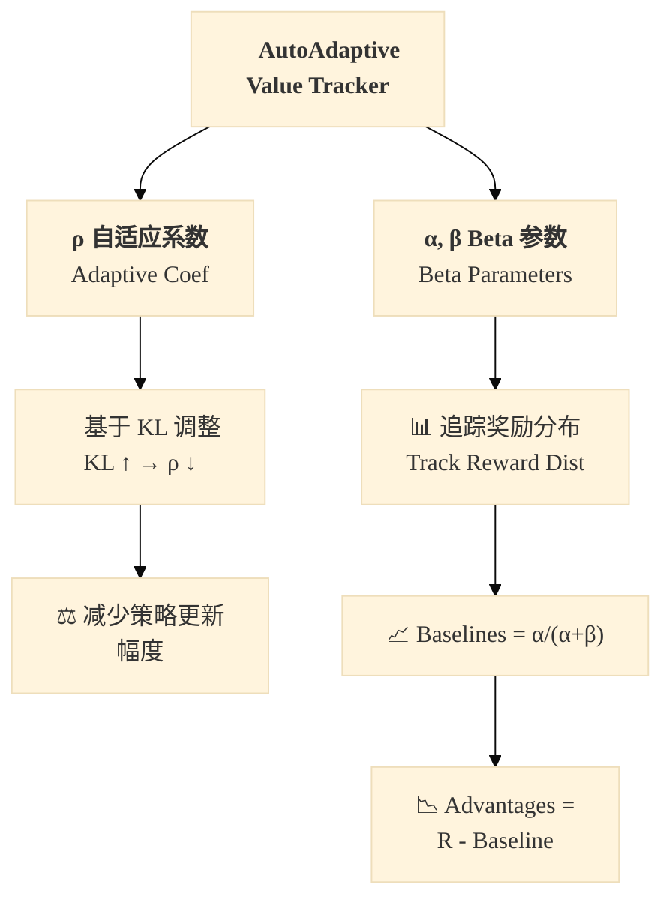

#### 4.5.2 自适应价值追踪器

```python
class AutoAdaptiveValueTracker:
    def __init__(self, rho_mode='kl', rho_const=0.9, D_half=0.06):
        self.rho_mode = rho_mode      # 'constant' 或 'kl'
        self.rho_const = rho_const    # 常数 ρ
        self.D_half = D_half          # KL 半衰期参数
        self.alpha = 0.5              # Beta 分布参数
        self.beta = 0.5
    
    def compute_rho(self, cur_mean_logprob):
        if self.rho_mode == 'constant':
            return self.rho_const
        
        if self.old_mean_logprob is None:
            return self.rho_const
        
        # 基于 KL 散度自适应调整 ρ
        kl = abs(self.old_mean_logprob - cur_mean_logprob)
        rho = 2 ** (-kl / self.D_half)  # 指数衰减
        return max(min(rho, 0.96), 0.5)  # 裁剪范围
    
    def update(self, rewards, cur_logprobs, response_masks):
        # 计算当前平均 logprob
        mean_logprob = ((cur_logprobs * response_masks).sum() / 
                        response_masks.sum()).item()
        
        # 自适应调整 ρ
        rho = self.compute_rho(mean_logprob)
        self.old_mean_logprob = mean_logprob
        
        # 归一化奖励到 [0, 1]
        scale = 3.0
        normalized_rewards = (rewards + scale) / (2 * scale)
        avg_normalized_reward = normalized_rewards.mean().item()
        
        # 指数移动平均更新 Beta 分布参数
        self.alpha = rho * self.alpha + avg_normalized_reward
        self.beta = rho * self.beta + (1 - avg_normalized_reward)
        
        return rho
    
    def get_baselines(self, batch_size):
        # Beta 分布均值作为基线
        baseline = self.alpha / (self.alpha + self.beta)
        return torch.full((batch_size,), baseline, dtype=torch.float32)
```

**面试要点**：
- SPO 优势：自适应调整，无需手动调参
- ρ 参数作用：平衡探索与利用
- Beta 分布基线：比固定值更鲁棒

### 4.6 对比总结

| 算法 | 奖励模型 | Critic 模型 | 适用场景 | 复杂度 |
|------|---------|-------------|---------|--------|
| **DPO** | ❌ | ❌ | 偏好数据充足 | ⭐ 低 |
| **PPO** | ✅ | ✅ | 通用场景 | ⭐⭐⭐ 高 |
| **GRPO** | ✅ | ❌ | 代码/数学推理 | ⭐⭐ 中 |
| **SPO** | ❌ | ❌ | 自适应场景 | ⭐⭐ 中 |

---

## 5. 知识蒸馏算法

### 5.1 知识蒸馏全景

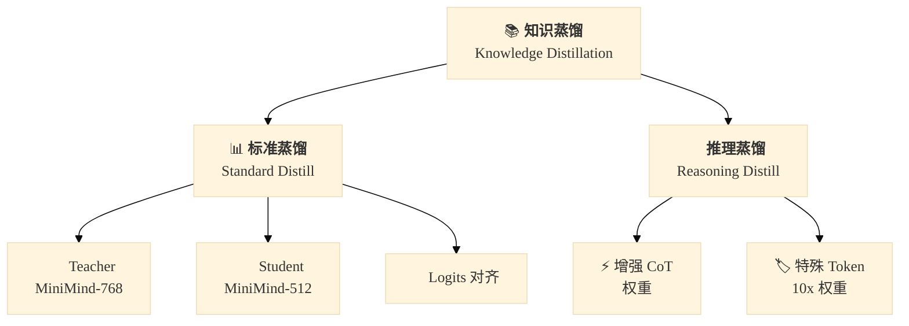

### 5.2 标准知识蒸馏

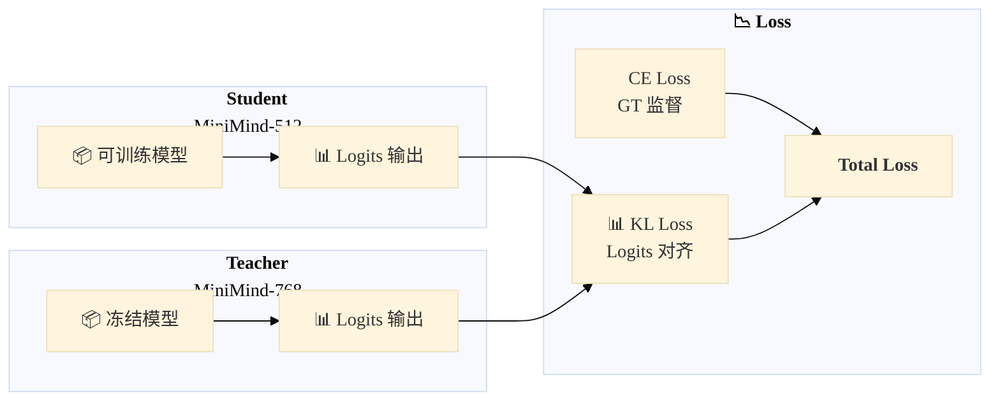

```python
def distillation_loss(student_logits, teacher_logits, temperature=1.0):
    # Teacher 概率分布
    with torch.no_grad():
        teacher_probs = F.softmax(teacher_logits / temperature, dim=-1)
    
    # Student 对数概率
    student_log_probs = F.log_softmax(student_logits / temperature, dim=-1)
    
    # KL 散度: KL(P||Q) = P * log(P/Q)
    kl = F.kl_div(
        student_log_probs,
        teacher_probs,
        reduction='batchmean',
        log_target=False
    )
    
    # 温度平方恢复
    return (temperature ** 2) * kl

# 总损失
total_loss = alpha * ce_loss + (1 - alpha) * kl_loss
```

### 5.3 推理蒸馏

针对 `<thought>` 等特殊 token 增加 10 倍损失权重：

```python
# 特殊 token IDs
start_of_think_ids = tokenizer('<thought>').input_ids
end_of_think_ids = tokenizer('</thought>').input_ids
start_of_answer_ids = tokenizer('<answer>').input_ids
end_of_answer_ids = tokenizer('</answer>').input_ids

# 生成损失掩码
sp_ids = torch.isin(
    Y.view(-1),
    torch.tensor(start_of_think_ids + end_of_think_ids + 
                 start_of_answer_ids + end_of_answer_ids).to(device)
)
loss_mask[sp_ids] = 10  # 10倍权重

# 最终损失计算
final_loss = (per_token_loss * loss_mask.view(-1)).sum() / loss_mask.sum()
```

---

## 6. 面试高频问题汇总

### 6.1 模型架构类问题

**Q1: RoPE 相比其他位置编码的优势是什么？**

A:
1. **可外推性**：支持更长上下文，YaRN 可扩展至 4 倍+
2. **计算高效**：只需预计算频率，无需额外参数
3. **相对位置感知**：自然保留相对位置信息
4. **数值稳定**：没有溢出风险

**Q2: GQA 和 MHA 的区别？为什么选择 GQA？**

A:
- MHA：Q/K/V 头数相同，每个头独立
- GQA：Q 头数是 KV 头数的 N 倍，KV 头被复用
- 优势：减少 50%+ KV cache 内存，加速推理
- 适用：推理场景，Qwen2/Llama3 采用

**Q3: MoE 为什么能以较少参数达到较大模型效果？**

A:
1. **稀疏激活**：每个 token 只激活 2-4 个专家
2. **负载均衡**：多专家分担不同知识
3. **参数高效**：总参数量大但推理计算量小
4. **知识专业化**：不同专家学习不同子任务

### 6.2 训练算法类问题

**Q4: DPO 相比 PPO 的优势和劣势？**

A:
- **优势**：无需奖励模型、训练更稳定、超参少
- **劣势**：需要高质量偏好对、数据成本高
- **适用**：偏好数据充足、追求稳定性的场景

**Q5: PPO 中 Clip 公式的作用是什么？**

A:
$$\min(r_t(\theta)\hat{A}_t, \text{clip}(r_t(\theta), 1-\epsilon, 1+\epsilon)\hat{A}_t)$$

- 限制策略更新幅度，防止策略崩溃
- 当 advantage 为正时，限制正向更新
- 当 advantage 为负时，限制负向更新

**Q6: GRPO 为什么不需要 Critic 模型？**

A:
- GRPO 使用组内相对奖励代替绝对值
- $A_i = (r_i - \text{mean}(r)) / \text{std}(r)$
- 相对值天然具有baseline效果
- 简化训练流程，降低计算开销

### 6.3 工程实践类问题

**Q7: 混合精度训练需要注意什么？**

A:
1. **Loss Scale**：防止 FP16 下溢
2. **Dynamic Loss Scaling**：自动调整 scale
3. **裁剪梯度**：防止 FP16 溢出
4. **特定层保持 FP32**：如 LayerNorm

**Q8: 如何实现高效的训练检查点恢复？**

A:
```python
def load_checkpoint(model, optimizer, scaler, path):
    ckp = torch.load(path, map_location=device)
    
    # 恢复模型权重
    model.load_state_dict(ckp['model'])
    
    # 恢复优化器状态
    optimizer.load_state_dict(ckp['optimizer'])
    
    # 恢复 AMP 状态
    scaler.load_state_dict(ckp['scaler'])
    
    # 恢复训练状态
    start_step = ckp['step']
    return start_step
```

**Q9: Flash Attention 的原理和优势？**

A:
- **原理**：分块计算 + 在线 softmax，将 $O(N^2)$ 降至 $O(N)$
- **优势**：
  - 减少显存占用（从 $O(N^2)$ 到 $O(N)$）
  - 提高计算吞吐
  - 利用 GPU 内存层次结构

---

## 7. 核心代码深度解析

### 7.1 完整模型定义

```python
class MiniMindModel(nn.Module):
    def __init__(self, config: MiniMindConfig):
        self.hidden_size = config.hidden_size
        self.num_layers = config.num_hidden_layers
        self.num_attention_heads = config.num_attention_heads
        self.use_moe = config.use_moe
        
        # 词嵌入
        self.embed_tokens = nn.Embedding(config.vocab_size, config.hidden_size)
        
        # Transformer 层
        self.layers = nn.ModuleList([
            MiniMindBlock(config) for _ in range(config.num_hidden_layers)
        ])
        
        # 输出归一化
        self.norm = RMSNorm(config.hidden_size, eps=config.rms_norm_eps)
        
        # 预计算 RoPE
        self.freqs_cos, self.freqs_sin = precompute_freqs_cis(
            config.hidden_size // config.num_attention_heads,
            config.max_position_embeddings * 2,
            config.rope_theta,
            getattr(config, 'rope_scaling', None)
        )
    
    def forward(self, input_ids: torch.Tensor, **kwargs):
        # 词嵌入
        hidden_states = self.embed_tokens(input_ids)
        
        # 位置编码
        seq_len = input_ids.shape[1]
        cos = self.freqs_cos[:seq_len]
        sin = self.freqs_sin[:seq_len]
        
        # Transformer 前向
        for layer in self.layers:
            hidden_states = layer(hidden_states, cos, sin, **kwargs)
        
        # 输出
        hidden_states = self.norm(hidden_states)
        return BaseModelOutputWithPast(last_hidden_state=hidden_states)
```

### 7.2 MiniMindBlock 实现

```python
class MiniMindBlock(nn.Module):
    def __init__(self, config: MiniMindConfig):
        super().__init__()
        self.hidden_size = config.hidden_size
        self.attention = Attention(config)
        self.feed_forward = FeedForward(config)
        self.attention_norm = RMSNorm(config.hidden_size, eps=config.rms_norm_eps)
        self.ffn_norm = RMSNorm(config.hidden_size, eps=config.rms_norm_eps)
        self.dropout = nn.Dropout(config.dropout)
    
    def forward(self, x, freqs_cos, freqs_sin, **kwargs):
        # Pre-LN 结构
        h = x + self.attention(self.attention_norm(x), freqs_cos, freqs_sin, **kwargs)
        out = h + self.feed_forward(self.ffn_norm(h))
        return out
```

### 7.3 KV Cache 推理

```python
def generate_with_cache(
    model,
    input_ids,
    max_new_tokens=100,
    temperature=1.0,
    top_p=0.9
):
    batch_size = input_ids.shape[0]
    past_key_values = None
    
    for _ in range(max_new_tokens):
        outputs = model(
            input_ids,
            past_key_values=past_key_values,
            use_cache=True
        )
        
        logits = outputs.logits[:, -1, :]
        past_key_values = outputs.past_key_values
        
        # 采样
        probs = F.softmax(logits / temperature, dim=-1)
        next_token = torch.multinomial(probs, 1)
        input_ids = torch.cat([input_ids, next_token], dim=-1)
    
    return input_ids
```

### 7.4 训练流程总结

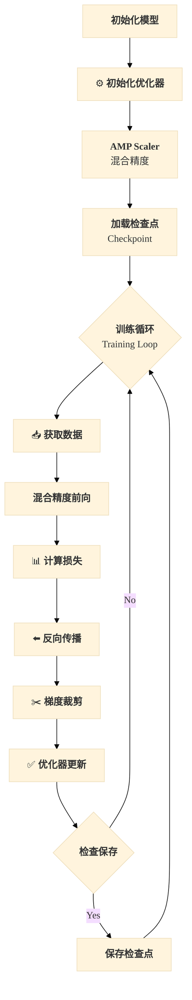

---

## 附录：MiniMind 模型规模

| 模型 | 参数量 | 隐藏层 | 层数 | KV 头 | 专家数 |
|------|--------|--------|------|-------|--------|
| MiniMind-Small | 25.8M | 512 | 8 | 2 | - |
| MiniMind-MoE | 145M | 640 | 8 | 2 | 4 |
| MiniMind-Base | 104M | 768 | 16 | 2 | - |

---

## 🎨 设计说明

本教程采用以下设计原则：

### 配色方案
- **蓝色系** (3d5a80, 98c1d9, e3f2fd): 模型架构相关
- **绿色系** (a5d6a7, c8e6c9): 预训练、优化相关
- **紫色系** (e1bee7, 7b1fa2): SPO、注意力机制
- **黄色系** (fff9c4, fcf6bd): 损失函数、奖励
- **粉色系** (ff99c8, c9184a): 对齐算法、PPO
- **橙色系** (fff3e0, e65100): 损失掩码、数据处理

### 视觉层次
- **一级节点**: 深色边框 + 填充
- **二级节点**: 中等边框 + 浅色填充
- **三级节点**: 细边框 + 极浅填充

### 字体
- 优先使用 Georgia 衬线字体，符合学术顶刊风格

---

> **面试建议**：
> 1. 理解每个算法的**核心直觉**，而不只是公式
> 2. 掌握**代码实现细节**，这是加分项
> 3. 能够**对比不同算法**的优劣和适用场景
> 4. 了解**工程实践经验**，如混合精度、梯度裁剪