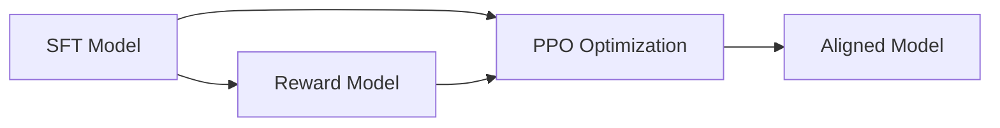
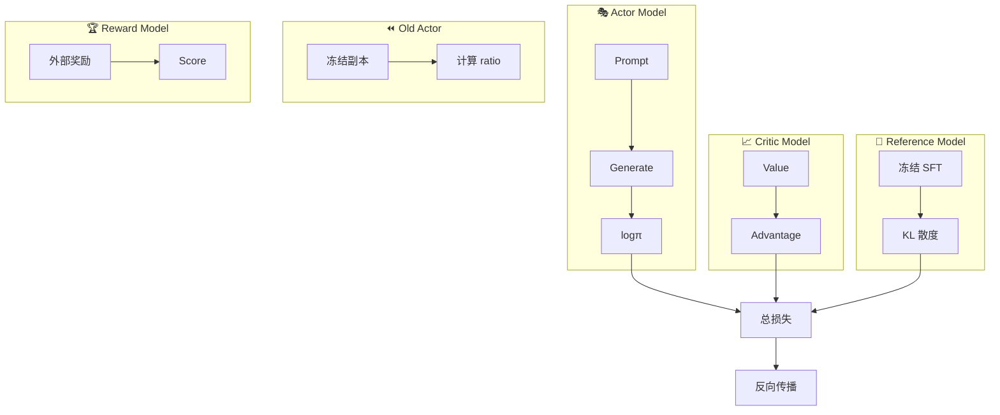

# MiniMind 面试实战：模拟问答

> 面向大模型算法岗面试的多轮深度对话

---

## 目录

1. [模型架构篇](#1-模型架构篇)
2. [预训练与SFT篇](#2-预训练与sft篇)
3. [对齐算法篇](#3-对齐算法篇)
4. [工程实践篇](#4-工程实践篇)
5. [开放性问题篇](#5-开放性问题篇)

---

## 1. 模型架构篇

### 问题 1：说说 Transformer 的整体架构

**面试官**：请描述一下 Transformer 的整体架构。

**学生**：好的。Transformer 基于自注意力机制，主要由编码器和解码器组成。对于 Decoder-Only 的 LLM 来说，核心组件包括：
- 词嵌入层（Embedding）
- 多头注意力（Multi-Head Attention）
- 前馈网络（FFN）
- 残差连接和层归一化
- 位置编码

**面试官**：能详细说说 Decoder-Only 架构的因果注意力机制吗？

**学生**：好的。因果注意力（Causal Attention）是指每个位置只能attend到它之前的位置。具体实现是在计算完 Q×Kᵀ 后，加上一个上三角掩码矩阵：

```python
scores = scores + torch.triu(
    torch.full((seq_len, seq_len), float("-inf")),
    diagonal=1
).unsqueeze(0).unsqueeze(0)
```

这样确保位置 t 的 token 不会看到位置 t+1 及之后的信息。

**面试官**：为什么需要位置编码？Transformer 本身没有循环结构，怎么表达位置信息？

**学生**：这是个好问题。Transformer 的自注意力机制本质上是置换不变的（permutation invariant），即打乱输入顺序不会改变输出。为了引入位置信息，需要额外编码。有几种主流方案：
- **绝对位置编码**：如 Sinusoidal 编码
- **相对位置编码**：如 RoPE、ALiBi
- **可学习的位置编码**：直接作为参数学习

**学生**：老师，我能追问一下吗？RoPE 为什么能保留相对位置信息？

**面试官**：问得好！RoPE 的核心思想是用旋转矩阵来编码位置。假设两个向量 q 和 k 分别在位置 m 和 n，经过 RoPE 编码后，它们的内积只和 (m-n) 有关：

$$RoPE(q_m, k_n) = Re[(q_m e^{imθ}) (k_n e^{inθ})^*] = f(q_m, k_n, m-n)$$

这样当我们在计算注意力分数时，天然就携带了相对位置信息，不需要额外的相对位置偏置。

**学生**：明白了！所以 RoPE 的优势是不需要额外的位置偏置项，同时具有良好的外推性。

**面试官**：对。你知道 RoPE 的外推能力为什么比 Sinusoidal 好吗？

**学生**：我猜测是因为 RoPE 的频率是连续的，而 Sinusoidal 编码在位置间隔较大时，高频分量会退化为常数。RoPE 通过低频插值、高频保持的方式实现了更好的外推。

**面试官**：没错。YaRN 就是基于这个原理，实现了 4 倍长度的上下文扩展。

---

### 问题 2：解释一下 GQA 和它的优势

**面试官**：什么是 Grouped Query Attention？它和 Multi-Head Attention 有什么区别？

**学生**：GQA（Grouped Query Attention）是分组查询注意力。它的特点是 Query 头的数量是 Key/Value 头数量的 N 倍。具体来说：
- MHA：Q=K=V=32 头
- GQA：Q=32 头，KV=4 头（每组 8 个 Q 头共享 1 个 KV 头）
- MQA：Q=32 头，KV=1 头

MiniMind 采用的是 GQA，配置为 8 个 Q 头和 2 个 KV 头。

**面试官**：为什么要复用 KV 头？有什么好处？

**学生**：核心优势是减少 KV cache 的内存占用。在自回归生成时，需要缓存历史位置的 KV。假设序列长度为 4096：
- MHA：需要缓存 32 个 KV 头
- GQA：只需要 2 个 KV 头（16 倍压缩）
- MQA：只需要 1 个 KV 头（32 倍压缩）

代码中通过 `repeat_kv` 函数将 KV 头复制 N 倍以匹配 Q 头数量：

```python
def repeat_kv(x: torch.Tensor, n_rep: int) -> torch.Tensor:
    bs, slen, num_kv_heads, head_dim = x.shape
    return x.view(bs, slen, num_kv_heads, 1, head_dim) \
           .expand(bs, slen, num_kv_heads, n_rep, head_dim) \
           .reshape(bs, slen, num_kv_heads * n_rep, head_dim)
```

**学生**：老师，我有个疑问。KV 头复用会不会影响模型表达能力？

**面试官**：这是关键问题。GQA 的设计基于一个假设：在实际学习中，不同 Q 头对 KV 的关注模式是相似的，复用不会显著损失表达力。实验证明 Qwen2、Llama3 采用 GQA 后，效果与 MHA 几乎持平，但推理速度提升明显。

**学生**：那 GQA 和 MQA 怎么选择？

**面试官**：一般来说：
- MQA 压缩率最高，但可能影响效果
- GQA 在效果和效率之间取得平衡
- 推荐使用 GQA（2-4 组）

---

### 问题 3：MoE 为什么能以较少的激活参数达到大模型效果？

**面试官**：请解释一下 MoE（Mixture of Experts）架构的原理。

**学生**：MoE 的核心思想是"稀疏激活"。对于每个输入 token，只激活部分专家网络（通常是 Top-2），而不是激活全部参数。具体结构：
- Gate 网络：决定每个 token 应该路由到哪些专家
- 专家池：多个独立的 FFN 网络
- 负载均衡损失：防止某些专家被过度使用

```python
class MoEGate(nn.Module):
    def forward(self, hidden_states):
        scores = F.linear(hidden_states, self.weight, None).softmax(dim=-1)
        topk_weight, topk_idx = torch.topk(scores, k=self.top_k)
        return topk_idx, topk_weight
```

**面试官**：为什么 MoE 能用较少的激活参数达到大模型效果？

**学生**：主要有三个原因：
1. **参数容量大**：总参数量可以是同等dense模型的 N 倍（如 4 专家就是 4 倍）
2. **计算量小**：每个 token 只激活 2-4 个专家，推理速度与 dense 模型相当
3. **知识专业化**：不同专家可以学习不同类型的知识（如代码、数学、自然语言）

**面试官**：你能解释一下负载均衡损失的作用吗？

**学生**：负载均衡损失是为了防止"专家塌陷"问题。如果所有 token 都路由到同一个专家，其他专家就得不到训练。损失函数设计为：

```python
expert_mask = F.one_hot(topk_idx, num_experts).float()
expert_load = expert_mask.sum(dim=0) / expert_mask.sum(dim=1)
aux_loss = (expert_load ** 2).mean()  # 让负载尽量均匀
```

**学生**：老师，MoE 在推理时有什么注意事项？

**面试官**：好问题。推理时需要注意：
1. **动态 batch**：不同输入可能激活不同专家
2. **专家并行**：大规模 MoE 需要专家并行策略
3. **路由效率**：要平衡延迟和负载

---

## 2. 预训练与SFT篇

### 问题 4：预训练的任务是什么？为什么选择 Next Token Prediction？

**面试官**：LLM 预训练的任务是什么？

**学生**：预训练的核心任务是因果语言建模（Causal Language Modeling），目标是预测下一个 token：

$$\mathcal{L} = -\sum_{t=1}^{T} \log P(x_t | x_{1:t-1})$$

代码实现：

```python
logits = model(X).logits  # [B, T, V]
loss = F.cross_entropy(logits[:, :-1].reshape(-1, V), Y[:, 1:].reshape(-1))
```

**面试官**：为什么选择 Next Token Prediction 而不是其他任务？

**学生**：有以下几个原因：
1. **自监督**：不需要人工标注
2. **通用性**：语言模型本质上是概率分布建模
3. **可扩展**：扩展到长文本、指令微调等场景
4. **Scaling Law**：随着参数量和数据量增加，能力持续提升

**学生**：老师，我有个疑问。BERT 使用的是掩码语言模型（MLM），为什么 Decoder-Only 模型不采用这个方式？

**面试官**：这是架构差异决定的：
- **BERT（Encoder）**：双向上下文，适合理解任务
- **GPT（Decoder）**：单向上下文，适合生成任务

MLM 需要看到左右两侧的上下文，而 Decoder-Only 的因果注意力只能看到左侧，所以采用 Next Token Prediction 更自然。

**面试官**：MiniMind 的预训练有什么特殊设计？

**学生**：MiniMind 支持 MoE 模式，此时总损失为：
$$\mathcal{L}_{total} = \mathcal{L}_{CE} + \lambda \cdot \mathcal{L}_{aux}$$

其中 $\mathcal{L}_{aux}$ 是负载均衡辅助损失，防止专家塌陷。

---

### 问题 5：SFT 和预训练有什么区别？动态损失掩码的作用？

**面试官**：监督微调（SFT）和预训练有什么本质区别？

**学生**：主要区别在于：
- **预训练**：从零开始，学习通用语言能力
- **SFT**：在预训练基础上，学习特定任务能力

SFT 的数据格式是对话形式：

```json
{
  "conversations": [
    {"role": "user", "content": "你好"},
    {"role": "assistant", "content": "你好！有什么可以帮助你的吗？"}
  ]
}
```

**面试官**：为什么 SFT 只计算 assistant 回复部分的损失？

**学生**：因为：
1. **避免学习 user 回复**：user 的回复是输入，不是模型需要学习的输出
2. **对齐人类偏好**：只对 assistant 的正确回复进行监督
3. **ChatML 格式**：通过特殊 token（`<|im_start|>`、`<|im_end|>`）区分角色

MiniMind 实现了动态损失掩码：

```python
def _generate_loss_mask(self, input_ids):
    loss_mask = [0] * len(input_ids)
    # 找到 assistant 回复区间，设置为 1
    for j in range(start + 1, end + len(self.eos_id)):
        loss_mask[j] = 1
    return loss_mask
```

**学生**：老师，如果对 user 部分也计算损失会怎样？

**面试官**：会导致几个问题：
1. **模型混淆**：学习 user 的回复模式没有意义
2. **性能下降**：增加无用的学习目标
3. **角色混乱**：模型可能学会"扮演 user"

**面试官**：SFT 的数据量应该如何选择？

**学生**：根据 MiniMind 的实践：
- 小模型（25M）：约 100K 条高质量对话
- 大模型（100M+）：约 1M 条高质量对话
- 关键是数据质量而非数量

---

## 3. 对齐算法篇

### 问题 6：什么是 RLHF？为什么要对齐？

**面试官**：什么是 RLHF（基于人类反馈的强化学习）？

**学生**：RLHF 是一种让模型输出更符合人类偏好的训练方法，流程：
1. **SFT**：有监督微调，构建初始模型
2. **奖励模型训练**：人类标注偏好对，训练奖励模型
3. **策略优化**：使用 PPO 等算法优化策略



**面试官**：为什么要做对齐？模型自己的能力还不够吗？

**学生**：对齐主要是解决几个问题：
1. **安全性**：避免有害、偏见输出
2. **有用性**：提供更有帮助的回答
3. **诚实性**：避免幻觉，更准确地回答
4. **遵循指令**：更好地理解用户意图

**学生**：老师，RLHF 和直接训练有什么区别？

**面试官**：关键区别在于优化目标：
- **直接训练**：优化困惑度（Perplexity）
- **RLHF**：优化人类偏好评分

困惑度高的模型不一定人类不喜欢，反之亦然。RLHF 直接优化"人类觉得好"这个目标。

---

### 问题 7：详细解释 DPO 的原理

**面试官**：请解释 DPO（Direct Preference Optimization）的原理。

**学生**：DPO 是一种无需奖励模型的对齐方法，核心思想是直接优化偏好数据。损失函数：

```python
def dpo_loss(policy_log_probs, ref_log_probs, chosen, rejected, beta=0.1):
    pi_logratios = policy_log_probs[chosen] - policy_log_probs[rejected]
    ref_logratios = ref_log_probs[chosen] - ref_log_probs[rejected]
    logits = pi_logratios - ref_logratios
    loss = -F.logsigmoid(beta * logits)
    return loss.mean()
```

等价形式：
$$\mathcal{L}_{DPO} = -\log \sigma(\beta (\log \frac{\pi(y^+)}{\pi(y^-)} - \log \frac{\pi_{ref}(y^+)}{\pi_{ref}(y^-)}))$$

**面试官**：DPO 相比 PPO 有什么优势？

**学生**：主要有以下优势：
1. **无需奖励模型**：直接从偏好对学习
2. **训练稳定**：没有策略梯度的高方差
3. **超参少**：只需要 β 一个参数
4. **计算高效**：不需要生成多个 response

**学生**：老师，DPO 里的 Reference Model 有什么作用？

**面试官**：Reference Model（通常是 SFT 后的模型）有两个作用：
1. **防止偏离**：KL 散度惩罚，防止策略偏离 SFT 太远
2. **归一化**：作为 baseline，计算相对改善

如果没有 Reference Model，模型可能会过度优化某些偏好，导致通用能力下降。

**面试官**：DPO 有什么局限性？

**学生**：局限性包括：
1. **需要偏好数据**：需要高质量的 chosen/rejected 对
2. **分布偏移**：偏好数据可能与实际分布不同
3. **表达能力**：偏好对只能表达相对偏好，无法表达绝对质量

---

### 问题 8：PPO 在 LLM 中的应用有什么特殊设计？

**面试官**：请描述 PPO 在 LLM 对齐中的完整流程。

**学生**：PPO 对齐流程包括多个组件：



关键组件：
1. **Actor**：可训练的策略模型
2. **Old Actor**：每隔 N 步复制，用于计算重要性采样 ratio
3. **Critic**：价值函数，估计期望回报
4. **Reference Model**：冻结的 SFT 模型，用于 KL 惩罚
5. **Reward Model**：提供奖励信号

**面试官**：PPO Clip 公式的作用是什么？

**学生**：Clip 公式限制策略更新幅度：

```python
ratio = torch.exp(actor_logp - old_logp)
surr1 = ratio * advantages
surr2 = torch.clamp(ratio, 1-ε, 1+ε) * advantages
policy_loss = -torch.min(surr1, surr2).mean()
```

当 advantages > 0 时：
- 如果 ratio > 1+ε，裁剪后不更新（防止过度优化）
- 如果 1 < ratio < 1+ε，正常更新

**学生**：老师，KL 散度惩罚的作用是什么？

**面试官**：KL 散度惩罚有两个目的：
1. **防止策略崩溃**：避免策略偏离 SFT 太远
2. **稳定性**：保持合理的更新方向

代码实现：

```python
kl = (actor_logp - ref_logp).mean()
loss = policy_loss + kl_coef * kl + vf_coef * value_loss
```

**面试官**：PPO 有什么常见问题和解决方案？

**学生**：常见问题：
1. **训练不稳定**：使用 KL 惩罚和 Gradient Clipping
2. **奖励黑客攻击**：奖励模型可能学习到虚假关联
3. **分布偏移**：使用 Importance Sampling 缓解

---

### 问题 9：GRPO 和 SPO 有什么创新点？

**面试官**：GRPO（Group Relative Policy Optimization）的核心创新是什么？

**学生**：GRPO 的创新是使用组内相对奖励，替代绝对奖励和 Critic 模型：

```python
# 组内奖励归一化
grouped_rewards = rewards.view(-1, num_generations)
mean_r = grouped_rewards.mean(dim=1).repeat_interleave(num_generations)
std_r = grouped_rewards.std(dim=1).repeat_interleave(num_generations)
advantages = (rewards - mean_r) / (std_r + 1e-8)
```

**面试官**：为什么 GRPO 不需要 Critic 模型？

**学生**：因为组内相对奖励天然具有 baseline 效果：
- $A_i = r_i - \text{mean}(r)$

相对奖励的中心化使得正负优势平衡，不需要额外的价值函数来估计 baseline。

**学生**：GRPO 适合什么场景？

**面试官**：GRPO 特别适合：
1. **有明确标准的任务**：如代码生成、数学推理
2. **可批量生成**：能一次生成多个 response
3. **奖励信号可比较**：不同 response 可以比较优劣

**面试官**：SPO（Self-Play Optimization）的创新点是什么？

**学生**：SPO 的核心是自适应价值追踪器：
1. **自适应 ρ 系数**：根据 KL 散度动态调整
2. **Beta 分布基线**：追踪奖励分布，自动调整基线

```python
class AutoAdaptiveValueTracker:
    def compute_rho(self, cur_kl):
        # KL 越大，ρ 越小
        return 2 ** (-cur_kl / self.D_half)
    
    def update(self, rewards, logprobs):
        # 更新 Beta 分布参数
        self.alpha = self.rho * self.alpha + rewards.mean()
        self.beta = self.rho * self.beta + (1 - rewards.mean())
    
    def get_baseline(self):
        return self.alpha / (self.alpha + self.beta)
```

**学生**：SPO 的自适应机制有什么好处？

**面试官**：好处包括：
1. **自动调参**：不需要手动设置 ρ 值
2. **平衡探索**：KL 大时减少更新幅度
3. **鲁棒性**：对奖励尺度不敏感

---

## 4. 工程实践篇

### 问题 10：混合精度训练的原理和注意事项

**面试官**：请解释混合精度训练的原理。

**学生**：混合精度训练使用 FP16（半精度浮点数）进行大部分计算，FP32 保存关键状态：

```python
# 自动混合精度
scaler = torch.cuda.amp.GradScaler()

with autocast(dtype=torch.float16):
    loss = compute_loss()

scaler.scale(loss).backward()
scaler.unscale_(optimizer)
torch.nn.utils.clip_grad_norm_(model.parameters(), max_norm)
scaler.step(optimizer)
scaler.update()
```

**面试官**：为什么需要混合精度？

**学生**：主要有以下优势：
1. **内存减半**：FP16 占用内存是 FP32 的一半
2. **计算加速**：Tensor Core 支持 FP16 计算
3. **带宽节省**：数据传输量减少

**面试官**：混合精度有什么注意事项？

**学生**：需要注意：
1. **Loss Scale**：FP16 表示范围较小，需要放大 loss 防止下溢
2. **动态调整**：使用 Dynamic Loss Scaling 自动调整 scale
3. **梯度裁剪**：防止 FP16 溢出
4. **特定层保持 FP32**：如 LayerNorm、RMSNorm

**学生**：老师，Loss Scale 具体是怎么工作的？

**面试官**：Loss Scale 的原理：

```python
# 放大 loss（防止下溢）
scaled_loss = loss * scale

# 反向传播
scaled_loss.backward()

# 缩小梯度（恢复正确尺度）
grads = grads / scale
```

如果检测到 NaN/Inf，自动减小 scale；如果连续 N 次没有下溢，尝试增大 scale。

---

### 问题 11：Flash Attention 的原理和优势

**面试官**：请解释 Flash Attention 的原理。

**学生**：Flash Attention 通过分块计算和在线 softmax 实现：

```python
# 传统 Attention: 需要 O(N²) 显存
attn = softmax(Q @ K.T / sqrt(d)) @ V

# Flash Attention: 分块计算，O(N) 显存
for block_q in blocks:
    for block_k in blocks:
        block_attn = softmax_local(Q_block @ K_block.T / sqrt(d))
        O_block = block_attn @ V_block
        # 在线合并结果
```

**面试官**：传统 Attention 的显存瓶颈在哪里？

**学生**：传统 Attention 需要计算完整的 $N \times N$ 注意力矩阵：
- 存储 $N \times N$ 的中间结果
- 显存复杂度：$O(N^2)$

对于 N=4096，FP16 需要 64MB；N=32768，需要 16GB。

**面试官**：Flash Attention 如何降低显存？

**学生**：Flash Attention 的技巧：
1. **分块计算**：每次只计算一小块
2. **在线 softmax**：避免存储完整矩阵
3. **融合算子**：减少内存访问

显存从 $O(N^2)$ 降至 $O(Nd)$（d 是头维度）。

**学生**：Flash Attention 有什么局限性？

**面试官**：局限性包括：
1. **硬件依赖**：需要 CUDA 和 Tensor Core
2. **掩码限制**：当前主要支持因果掩码
3. **序列长度**：对极长序列可能仍需 chunk

---

### 问题 12：如何实现高效的检查点恢复？

**面试官**：在大模型训练中，如何实现高效的检查点恢复？

**学生**：检查点需要保存多个组件：

```python
def save_checkpoint(model, optimizer, scaler, scheduler, step, path):
    checkpoint = {
        'model': model.state_dict(),
        'optimizer': optimizer.state_dict(),
        'scaler': scaler.state_dict(),
        'scheduler': scheduler.state_dict() if scheduler else None,
        'step': step,
        'timestamp': time.time()
    }
    torch.save(checkpoint, path)

def load_checkpoint(model, optimizer, scaler, path):
    checkpoint = torch.load(path, map_location=device)
    model.load_state_dict(checkpoint['model'])
    optimizer.load_state_dict(checkpoint['optimizer'])
    scaler.load_state_dict(checkpoint['scaler'])
    return checkpoint['step']
```

**面试官**：如何优化大模型检查点的保存速度？

**学生**：优化方法：
1. **异步保存**：在后台进程保存，不阻塞训练
2. **分片保存**：将模型分片，每个 rank 保存自己的部分
3. **压缩存储**：使用 torch.save(..., _use_new_zipfile_serialization)

```python
# 异步保存示例
import threading

def save_async(checkpoint, path):
    thread = threading.Thread(target=torch.save, args=(checkpoint, path))
    thread.start()
    return thread
```

**面试官**：如何处理部分检查点恢复？

**学生**：有时只需要恢复部分状态：

```python
# 只恢复模型权重
model.load_state_dict(checkpoint['model'], strict=False)

# 从不同模型恢复
state_dict = {k: v for k, v in checkpoint['model'].items() 
              if k in model.state_dict()}
model.load_state_dict(state_dict, strict=False)
```

---

## 5. 开放性问题篇

### 问题 13：如何设计一个高效的推理系统？

**面试官**：如果要设计一个高效的大模型推理系统，你会考虑哪些方面？

**学生**：我会从以下几个维度考虑：

1. **模型优化**
   - 量化（INT8/INT4）
   - 蒸馏（知识蒸馏）
   - 剪枝（结构化/非结构化）

2. **系统优化**
   - KV Cache 复用
   - 连续批处理（Continuous Batching）
   - 异步调度

3. **硬件优化**
   - Tensor Core 利用
   - 内存池管理
   - 算子融合

**面试官**：KV Cache 复用具体怎么做？

**学生**：对于多轮对话，之前的 KV Cache 可以复用：

```python
def chat_with_cache(model, history, new_input):
    # 编码新输入
    new_ids = tokenizer(new_input).input_ids
    
    # 合并历史和输入
    if history.cache is not None:
        # 使用缓存的 KV
        output = model(new_ids, past_key_values=history.cache)
    else:
        output = model(new_ids)
    
    # 更新缓存
    history.cache = output.past_key_values
    return output
```

**面试官**：连续批处理（Continuous Batching）的原理是什么？

**学生**：传统批处理等待批次内所有请求完成，而连续批处理动态调整：

```
时间 t:   [Req A] [Req B] [Req C] [Req D]
时间 t+1: [Req A✓] [Req B] [Req C] [Req D] [Req E]
时间 t+2: [Req A✓] [Req B✓] [Req C] [Req D] [Req E] [Req F]
```

每个请求完成后，立即加入新请求，最大化 GPU 利用率。

---

### 问题 14：如何处理大模型的长上下文问题？

**面试官**：如何处理大模型的长上下文问题？

**学生**：主要有几种方法：

1. **位置编码外推**
   - RoPE + YaRN：线性插值低频，保持高频
   - ALiBi：线性偏置，无需外推

2. **注意力优化**
   - Sparse Attention：稀疏模式
   - Linear Attention：线性复杂度
   - Flash Attention：高效实现

3. **显存优化**
   - KV Cache 压缩
   - 分块计算
   - 梯度检查点

**面试官**：YaRN 的具体实现原理是什么？

**学生**：YaRN 的核心是对不同频率采用不同策略：

```python
def yarn_freqs(dim, max_len, factor=16):
    # 低频位置：线性插值
    low_freq_factor = 1
    # 高频位置：保持原样
    high_freq_factor = factor
    
    # 根据位置动态调整频率
    for i in range(dim // 2):
        pos = min(i, orig_max) / orig_max
        if pos < 1 / factor:
            freqs[i] = freqs[i] / low_freq_factor
        else:
            freqs[i] = freqs[i] / high_freq_factor
```

**面试官**：长上下文还有什么其他挑战？

**学生**：还有：
1. **准确性问题**：模型可能忽略中间内容
2. **位置偏见**：更关注开头或结尾
3. **显存压力**：长序列 KV Cache 巨大

**学生**：老师，怎么缓解位置偏见问题？

**面试官**：方法包括：
1. **ALiBi**：用线性偏置替代绝对位置
2. **Sandwich**：在开头和结尾复制关键内容
3. **注意力 head 专业化**：不同 head 学习不同位置偏好

---

### 问题 15：如何看待大模型的发展趋势？

**面试官**：你怎么看大模型未来几年的发展趋势？

**学生**：我关注几个方向：

1. **效率提升**
   - 更高效的架构（如 Mamba）
   - 更好的量化方法
   - 专用硬件

2. **能力增强**
   - 多模态融合
   - 长上下文理解
   - 推理能力提升

3. **安全对齐**
   - 更可靠的对齐方法
   - 可解释性研究
   - 安全评估

**面试官**：你对模型架构的未来有什么看法？

**学生**：我看到几个趋势：
1. **注意力机制优化**：从 Transformer 向 SSM 演进
2. **混合专家普及**：更高效的参数利用
3. **多模态统一**：文本、图像、视频统一表示

**面试官**：作为面试者，你觉得什么能力最重要？

**学生**：我觉得以下几点很重要：
1. **理论基础**：理解核心原理，而非仅仅调参
2. **工程能力**：能实现和优化
3. **学习能力**：快速跟进最新进展
4. **问题分析**：拆解问题、定位根因

---

## 附录：面试清单

### 必考知识点

| 类别 | 核心问题 |
|------|---------|
| 模型架构 | Transformer、RoPE、GQA、MoE |
| 训练算法 | 预训练、SFT、DPO、PPO、GRPO |
| 工程实践 | 混合精度、Flash Attention、分布式 |
| 原理理解 | 为什么这么做、trade-off 是什么 |

### 面试技巧

1. **先说结论**：用一句话概括核心观点
2. **分点阐述**：用 1、2、3 清晰列出
3. **结合代码**：能讲出具体实现细节
4. **举一反三**：能对比不同方案的优劣

---

> **面试建议**：
> 1. 基础概念要扎实，能手推公式
> 2. 工程实践要了解，知道为什么这么做
> 3. 开放问题要有自己的思考和见解
> 4. 保持谦逊，不确定的问题坦诚回答
